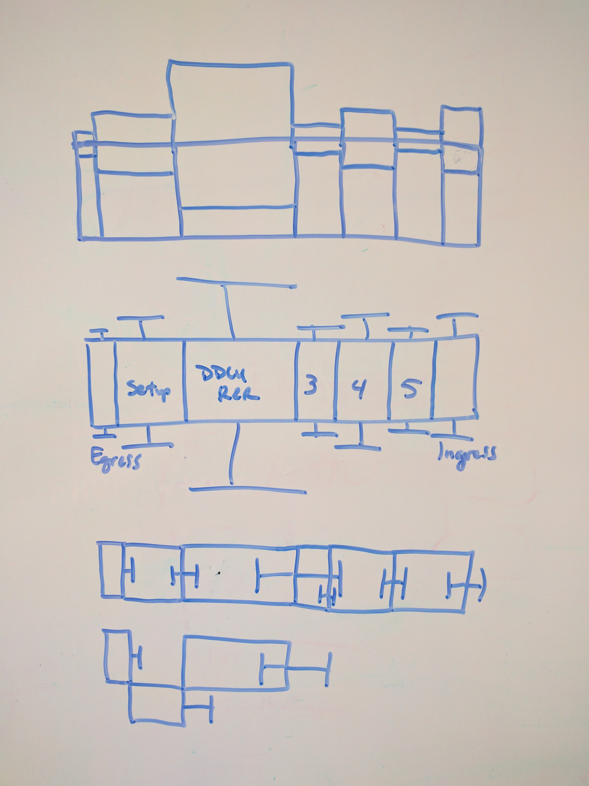

# OVERHAUL PROJECT
This page provides the basic idea and requirements for a project to remove the dependency on forms and instead to use a drag 'n drop, WYSIWYG-style interface.

## GENERAL CONCEPT
Begin by reading [README.md](README.md)

Currently, this extension heavily relies on Extension:PageForms (previously known as Semantic Forms) for the creation and revision of a summary timeline. The main goal of this project is to remove that dependency. Instead of using a form, the user should be able to drag and drop blocks in a What You See Is What You Get (WYSIWYG) manner. There will still need to be a form of some kind to capture the title and other text field type data, but the overall experience needs to be easier.

## REQUIREMENTS
1. All of the existing property values captured by the form interface and saved to the page must be handled by the new system. Changes to the template that sets these values using Semantic MediaWiki can be made, but this data must be set within the wiki so it can be queried on other pages.
1. In the edit interface, a user should be able to drag an activity block earlier or later in the timeline within a single row
1. In the edit interface, a user should be able to drag an activity block from one row ("actor") to another
1. In the edit interface, a user should be able to click an activity block and then drag its border to make it shorter or longer in duration
1. In the edit interface, the color scheme should have the default option for the tool to automatically choose appropriate colors based on the activity grouping. The color scheme should have another option for the user to specify colors they choose using a simple color wheel (no text required).

## BONUS POINTS
The current visualization shows explicit values for each block's duration. See the example below:

It would be nice to be able to show the variance for each block's duration, as determined by analyzing training data. For example, we might perform 5 training runs for a particular task in the [NBL](https://en.wikipedia.org/wiki/Neutral_Buoyancy_Laboratory). From those data we can calculate a set of summary statistics including the minimum, maximum, mean, median, and standard deviation for duration. Bonus points will be awarded for designing and implementing an effective and intuitive way of visualizing the variance in duration for each block in a timeline. See the image below for some concepts:

