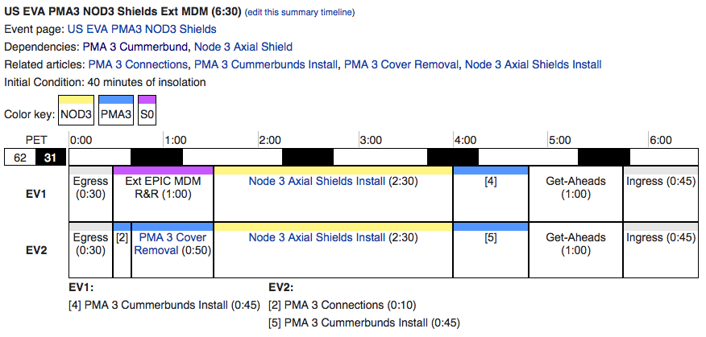
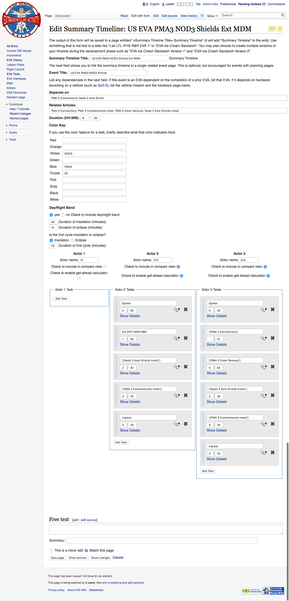

# SummaryTimeline

This extension creates a graphic representation of a summary timeline. It is designed for EVA planning, but can be used for any  kind of timeline planning. While the parser function could be used on its own, it is best to use the supplied semantic form to build timelines.



## OVERHAUL PROJECT
See [this page](OVERHAUL.md) for details on a project to remove the dependency on forms and instead to use a drag 'n drop, WYSIWYG-style interface.

## DEPENDENCIES

* Extension:Semantic Mediawiki
* Extension:Semantic Forms
* Extension:Semantic Internal Objects
* Extension:Variables
* Extension:NumerAlpha

Semantic form, templates, properties included in xml files


## INSTALLATION

Note that v0.2.0 works with SMW 2.0+. Once you upgrade to SMW 3.0, you will need Summary Timeline v0.2.1 or higher.

Download the extension files to your extensions directory. Add the following line to LocalSettings.php:

```html
require_once "$IP/extensions/SummaryTimeline/SummaryTimeline.php";
```

Import the following two files using the "Special:Import" feature in MediaWiki. For the "Interwiki prefix:" input "en".
* SummaryTimeline-FormCategory&Templates.xml
* SummaryTimeline-Properties.xml

Additionally, you may import the following file to see some example pages:
* SummaryTimeline-ExtensionDemoPages.xml

For reference, these pages have been given the following categories to ease in the export process:

* Form Used for Summary Timeline Extension
* Category Used for Summary Timeline Extension
* Template Used for Summary Timeline Extension
* Property Used for Summary Timeline Extension
* Summary Timeline Extension Demo Page

## ENTERING DATA

Begin by clicking a link to Special:FormEdit/Summary_Timeline. There you can give a name to the timeline like "Failed FHRC Removal EVA Version 2". You can list out dependencies, related articles, the duration of the EVA, and then the details of each task. If you choose to mark some tasks with a color, use the color key to explain what each color indicates. Clicking "Save page" creates the page with all the entered data.

Here is an example of what editing a timeline via the form could look like:



The data is handled by the main Template:Summary Timeline and the multiple-instance templates for each actor. Currently, this extension is limited to three actors. In the future, I plan to allow more actors and make the form better accommodate this many columns.

The form will generate a page with content like the following example:

```html
{{Summary Timeline
|ST Title=US EVA PMA3 NOD3 Shields Ext MDM
|EVA Title=US EVA PMA3 NOD3 Shields
|Depends on=PMA 3 Cummerbund, Node 3 Axial Shield
|Related article=PMA 3 Connections, PMA 3 Cummerbunds Install, PMA 3 Cover Removal, Node 3 Axial Shields Install
|EVA Duration hour=6
|EVA Duration minute=30
|Color Yellow Meaning=NOD3
|Color Blue Meaning=PMA3
|Color Purple Meaning=S0
|Include Day Night=yes
|Insolation Duration=62
|Eclipse Duration=31
|First Cycle Day Night=Insolation
|First Cycle Duration=40
|Actor 1 name=IV
|Actor 2 name=EV1
|Actor 3 name=EV2
|Actor 1 Display in Compact View=No
|Actor 2 Display in Compact View=Yes
|Actor 3 Display in Compact View=Yes
|Actor 1 Enable Get Aheads=No
|Actor 2 Enable Get Aheads=Yes
|Actor 3 Enable Get Aheads=Yes
|Actor 2 Tasks={{Actor 2 Task
|Title=Egress
|Duration hour=0
|Duration minute=30
|Color=gray
}}{{Actor 2 Task
|Title=Ext EPIC MDM R&R
|Duration hour=1
|Duration minute=00
|Color=purple
}}{{Actor 2 Task
|Title=[[Node 3 Axial Shields Install]]
|Duration hour=2
|Duration minute=30
|Color=yellow
}}{{Actor 2 Task
|Title=[[PMA 3 Cummerbunds Install]]
|Duration hour=0
|Duration minute=45
|Color=blue
}}{{Actor 2 Task
|Title=Ingress
|Duration hour=0
|Duration minute=45
|Color=gray
}}
|Actor 3 Tasks={{Actor 3 Task
|Title=Egress
|Duration hour=0
|Duration minute=30
|Color=gray
}}{{Actor 3 Task
|Title=[[PMA 3 Connections]]
|Duration minute=10
|Color=blue
}}{{Actor 3 Task
|Title=[[PMA 3 Cover Removal]]
|Duration hour=0
|Duration minute=50
|Color=blue
}}{{Actor 3 Task
|Title=[[Node 3 Axial Shields Install]]
|Duration hour=2
|Duration minute=30
|Color=yellow
}}{{Actor 3 Task
|Title=[[PMA 3 Cummerbunds Install]]
|Duration hour=0
|Duration minute=45
|Color=blue
}}{{Actor 3 Task
|Title=Ingress
|Duration hour=0
|Duration minute=45
|Color=gray
}}
}}
```

## DISPLAYING DATA

The output of a summary timeline is handled by Template:Summary Timeline Output.

For the compact version (default):
```html
{{Summary Timeline Output | Page name of summary timeline to display | Compact }}
  ```

To force the compact version to a fixed pixel width to fit on a specific page:
```html
{{Summary Timeline Output | Page name of summary timeline to display | Compact | 123 }}
  ```

For the full version:
```html
{{Summary Timeline Output | Page name of summary timeline to display | Full }}
  ```

This template generates a call to the #summary-timeline parser function and passes all the necessary information about the EVA and its tasks. The generic information about the EVA is queried from the page generated by the form as mentioned above. The task-specific information is queried from the Semantic Internal Objects created for each task.

